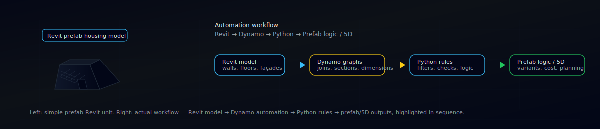
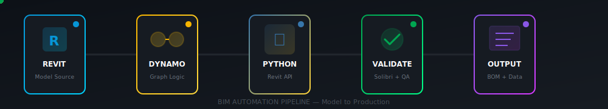

<div align="center">



# Sam

**Product Engineer — Digital Construction & BIM Automation**

I build the automation layer between design intent and factory output.  
Revit models that behave. Façade logic that production teams can trust.

<br/>

[](https://www.linkedin.com/in/samamohammad-92790416b)
[](https://github.com/Sammohammad78)

</div>

---

## About

Product engineer at **Heijmans Woningbouw** in the Netherlands, working on industrialised housing and prefab systems.

I write Dynamo scripts and Python tools that turn Revit from a drawing application into a production system — where walls join correctly, sections align automatically, and façade configurations follow rules instead of tribal knowledge.

Fifteen years in construction. Background in façade engineering.

**Languages:** English • Nederlands • Türkçe • العربية

---

## Tech Stack

<div align="center">

</div>

<br/>

<div align="center">

### BIM & Coordination


### Development


### Platforms & Data


</div>

---

## What I Build
<div align="center">
<table>
<tr>
<td width="50%" valign="top">

### Prefab Housing Systems

Rule-based workflows for modular construction:

- Component logic for walls, floors, roofs, façades
- Variant handling across productised housing concepts
- Validation tools that catch issues before production

</td>
<td width="50%" valign="top">

### Revit Automation

Repeatable rules instead of manual work:

- Section alignment with house-type detection
- Dimensioning strategies enforced across views
- Wall join logic for prefab module connections

</td>
</tr>
<tr>
<td width="50%" valign="top">

### Façade Engineering

Parametric systems that stay synchronised:

- Panel grids and sub-frames from constraint sets
- Geometry, schedules, and BOM exports aligned
- Climate-responsive configurations

</td>
<td width="50%" valign="top">

### BIM → Data Pipelines

Structured exports for downstream systems:

- Model data to estimating and planning tools
- Power BI dashboards for QA and reporting
- Coordination workflows via ACC and BIM 360

</td>
</tr>
</table>

---

## Workflow

<div align="center">



</div>

---

## Selected Work

| System | What It Does | Stack |
|:-------|:-------------|:------|
| **Section Alignment Engine** | Auto-targets and crops sections based on house-type patterns (VGER/VGEL detection) | `Dynamo` `Python` `Revit API` |
| **Wall Seam Resolver** | Fixes joins at prefab module boundaries automatically | `CPython3` `Dynamo 4.0` |
| **Interior Dimensioning System** | Enforces dimensioning rules across all plan views | `Dynamo` `Python` |
| **Parametric Façade Generator** | Constraint-driven panel layouts with synchronised BOMs | `Dynamo Sandbox` `Python` |
| **Model Diagnostic Suite** | Validation and QA tooling for production-ready models | `pyRevit` `Solibri` `Python` |

---

## Approach

```text
The point is not clever automation. The point is boring consistency.

→ Clear rules instead of personal habits
→ Fewer manual edits, fewer surprises in deliverables
→ Models that downstream teams can rely on without reverse-engineering intent
```

---

## Background

- **15+ years** in environmental and façade engineering  
- Based in the Netherlands, working on industrialised housing at scale

---

<div align="center">

**Interested in prefab systems, BIM automation, or industrialised construction?**

[](https://www.linkedin.com/in/samamohammad-92790416b)

</div>
